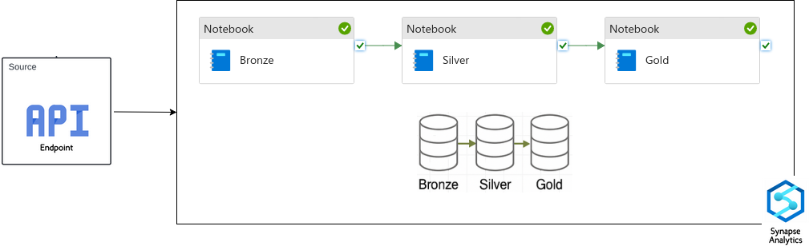

# Earthquake Data Ingestion & Processing Pipeline using Azure Synapse

This repository contains an end-to-end data pipeline implemented using **Azure Synapse Notebooks** to ingest, process, and enrich **earthquake data** from the [USGS Earthquake API](https://earthquake.usgs.gov/fdsnws/event/1/). The pipeline is organized in a **multi-layered architecture (Bronze, Silver, and Gold)** and is executed daily to ensure a steady flow of fresh, near real-time data.

---

## 📌 Project Structure

- **Bronze Layer**  
  Retrieves raw earthquake data from the USGS API and saves it in **JSON** format into the **Bronze ADLS Gen2** container.

- **Silver Layer**  
  Reads and flattens the nested JSON data, selects relevant fields (e.g., coordinates, magnitude, time), performs basic cleaning and validation, and stores the results in **Parquet** format in the **Silver ADLS Gen2** container.

- **Gold Layer**  
  Enriches the data by:
  - Using **reverse geocoding** (via `reverse_geocoder`) to append **country codes** based on latitude and longitude.
  - Adding a **significance classification** (Low / Moderate / High) based on the `sig` value.
  - Saving the enriched dataset in **Parquet** format to the **Gold ADLS Gen2** container.

---

## 🔁 Automation

This pipeline is configured with a **daily trigger** in Azure Synapse Pipelines.  
Thanks to this automation, the system continuously ingests fresh data, enabling **near real-time analytics** and up-to-date insights.

---

## 🚀 Technologies Used

- **Azure Synapse Analytics**  
- **Apache Spark (PySpark)**
- **Azure Data Lake Storage Gen2 (ADLS Gen2)**
- **USGS Earthquake API**
- **reverse_geocoder** Python package
- **Python, JSON, Parquet**
  
---

## 📦 Sample Output Fields (Gold Layer)

| Field              | Description                                 |
|--------------------|---------------------------------------------|
| `id`               | Unique identifier of the earthquake event   |
| `longitude`        | Longitude of the epicenter                  |
| `latitude`         | Latitude of the epicenter                   |
| `elevation`        | Elevation in meters                         |
| `title`            | Short title of the earthquake               |
| `place_description`| Location description from USGS              |
| `mag`              | Magnitude                                   |
| `magType`          | Type of magnitude (e.g., mb, ml, etc.)      |
| `time`             | Event timestamp (converted to UTC)          |
| `updated`          | Timestamp of the last update                |
| `country_code`     | ISO-2 country code via reverse geocoding    |
| `sig`              | Significance value                          |
| `sig_class`        | Low / Moderate / High                       |

